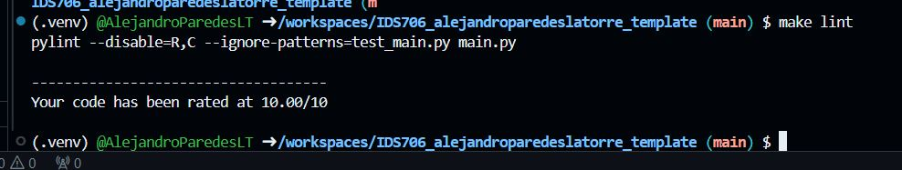
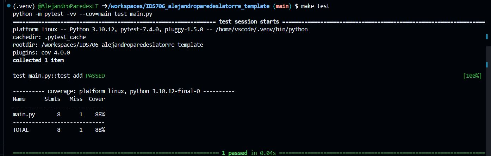

# IDS706_alejandroparedeslatorre_template
Second Assignment IDS-706 Alejandro Paredes La Torre 

This repo contains a brief implementation of basic descriptive metrics for the Boston Housing dataset. If you want to use this just refer this to a codespace in github and wait for the devcontainer to execute the Makefile that execute the following: install, format, lint, test.

According to the requirement it gets added

* `Makefile`

* `Dockerfile`

* `requirements.txt` with a set of specifications

* `githubactions` 

* `.devcontainer` for Githubcodespace 

## Purpose of project
The purpose of this project is to have a dataframe as input and compute the mean, median, std and plot some charts. To test this function the file test_main.py is used

## Preparation
1. open codespaces 
2. load repo to code spaces
2. Wait for the installation of all the requirements in requirements.txt

## Output
1. We have as a result a markdown 
2. Lint code `make lint`

3. Test code `make test`

